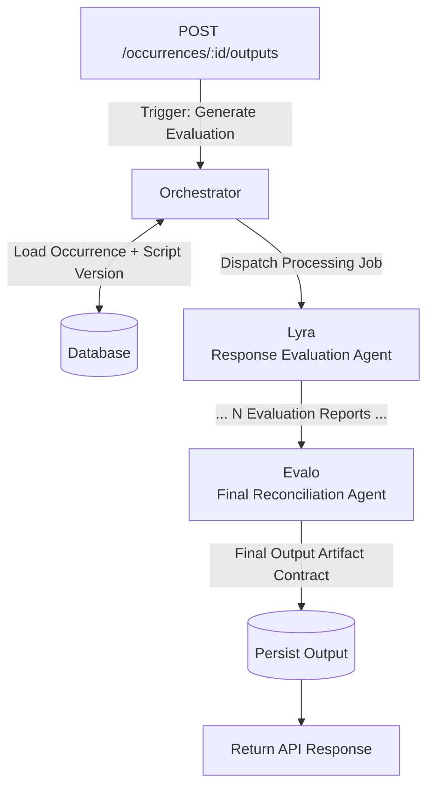

# Evalo (evalo.ai)

## Objective

The goal of this project is to explore AI systems focused on guiding processes of job assessments, such as software engineer positions.

It should be guided by well-defined scripts composed of different types of interaction units such as right/wrong questions (for technical knowledge validation), descriptions of professional experience, and even hands-on pseudo-code tasks in the context of software engineering.

The input should consist of both the guiding scripts and the conversation itself, while the output will be a written artifact enriched with the collected answers, along with a conclusion specific to the interview context (e.g., technical feedback on a candidate).

## MVP definition

The MVP will be based on interviews for Software Developer positions (JavaScript FE developer, intern etc) and will occur in three fronts:

1. **Preparation of the testing data**
    
    1.1. Script
    
    Will consist of an interview based on a spreadsheet of questions and will be modeled into structured data.
    
    1.2. Recordings
    
    Interviews will be conducted using standard video-conferencing tools (e.g., Microsoft Teams or Google Meet), with automatic audio transcription enabled. A small sample set of three to five technical interviews will be recorded, covering different levels of seniority (junior, mid-level, and senior software developers).
    
    1.3. Treatment of recordings
    
    The raw transcriptions may require post-processing due to common issues such as word swaps that could be redefined through context. A dedicated AI agent may be applied to normalize, clean, and structure the transcripts before they are used as input for analysis and artifact generation.
    
2. **Development**
    
    2.1. **API**
    
    A RESTful API will be implemented using NestJS and deployed in a serverless environment on a cloud service provider (likely AWS). The API will connect to a Mongo database for structured/unstructured data persistence and to a binary object storage service (e.g., S3) for storing assets such as transcripts.
    
    2.2. **UI**
    
    A minimal web-based UI will be developed to consume the API and validate end-to-end flows. The UI will also be deployed serverless and will focus on enabling basic interaction with scripts, interviews, and results.
    
    The login screen will provide a simple authentication flow, serving primarily to gate access to the MVP features rather than enforce production-grade security.
    
3. **Testing**
    
    *TBD*
    

## Requirements

### 1. API routes
    
    - **Users**:
        - `GET /users`
        - `POST /users`
        - `PUT /users/:id`
        - `GET /users/:id`
        - `DELETE /users/:id`
        - `POST /users/authenticate`
        - `POST /users/change-password`
    - **Scripts**:
        - `GET /scripts`
        - `GET /scripts/:id`
        - `POST /scripts`
        - `PUT /scripts/:id`
        - `DELETE /scripts/:id`
    - **Script blocks** (scoped by script ID):
        - `GET /scripts/:script-id/blocks`
        - `POST /scripts/:script-id/blocks`
        - `PUT /scripts/:script-id/blocks/:block-id`
        - `DELETE /scripts/:script-id/blocks/:block-id`
    - **Occurrences** (scoped by script ID):
        - `GET /scripts/:script-id/occurrences`
        - `POST /scripts/:script-id/occurrences`
        - `PUT /scripts/:script-id/occurrences/:occurrence-id`
        - `DELETE /scripts/:script-id/occurrences/:occurrence-id`
    - **Output** (scoped by occurrence ID):
        - `GET /scripts/:script-id/occurrences/:occurrence-id/outputs`
        - `POST /scripts/:script-id/occurrences/:occurrence-id/outputs`
        - `PUT /scripts/:script-id/occurrences/:occurrence-id/outputs/:id`
        - `DELETE /scripts/:script-id/occurrences/:occurrence-id/outputs/:id`

### 2. Entities

**a) Script Block**

Represents a question in the interview’s script and can be of the following types:

- EVAL: evaluated answers. which means that a correct one exists and is expected (at least partially);
- OPEN: a space for answers that are beyond right/wrong (e.g.: academic trajectory, professional experiences etc);

The content is the question itself and it’s always bound to a specific parent script.

Blocks always have a tag that's meant to group questions such "JavaScript" or "DevOps Engineering".

The objective describes what the question aims to evaluate. E.g.:

> *Question: “What can you tell me about code coverage?”*
> 
> 
> *Objective: To see if the user knows the concept and understands that it doesn’t always translate to code quality.*
> 

**Attributes:**

- Id (uuid)
- Script Id (uuid)
- Created At (date time, read only)
- Updated At (date time, read only)
- Tag (string)
- Type (EVAL, OPEN)
- Content (string)
- Objective (optional string)
- Expected Response (optional string, required if Type is EVAL)
- Common Mistakes (optional string)

**b) Script**

Represents the template of an interview process. A script defines the structure, intent, and ordering of questions that should be used to guide a specific type of interview (e.g.: technical assessment).

A script is composed of a collection of *script blocks*, which represent individual interaction units (questions or tasks). Scripts are versioned to ensure that interview executions can always be traced back to the exact structure and expectations that were in place at the time of the interview.

Conceptually:

- **Script** = Interview template definition
- **Occurrence** = Execution of a specific Script version using a real conversation transcript and producing an output artifact

Scripts are immutable once used in an occurrence. Any modification to blocks, expected responses, or structure should result in a new script version.

**Attributes:**

- Id (uuid)
- Owner (uuid)
- Title (string)
- Type (string - in the MVP will always be TECHNICAL_INTERVIEW)
- Version (number, incremented)
- Description (optional string)
- Created At (date time, read only)
- Updated At (date time, read only)
- Blocks (collection of `<Script Block>`)

**c) Occurrence**

Represents the execution of an interview using a specific version of a script. An occurrence links a script template to a real interview instance, containing the collected conversation transcript and serving as the source input for evaluation and output artifact generation.

Each occurrence is immutable in relation to the script structure it was executed against. This is ensured by storing both the script identifier and the script version used at execution time.

An occurrence represents a single completed or in-progress interview session.

**Attributes:**

- Id (uuid)
- Script Id (uuid)
- Script Version (number)
- Applicant Name (string)
- Status (enum: CREATED, COMPLETED)
- Transcript Raw (string or large text field)
- Output Id (optional uuid)
    
    *(Reference to the generated output artifact once evaluation is completed.)*
    
- Created At (date time)
- Started At (date time)
- Finished At (optional date time)

**d) Output Artifact**

Represents the final structured written result generated from an occurrence after transcript analysis and evaluation. The output artifact consolidates evaluation results, contextual feedback, and a final conclusion according to the interview type defined by the script.

The output artifact is generated after an occurrence is processed and is intended to be human-readable, structured, and traceable to the script and transcript that originated it.

**Attributes:**

- Id (uuid)
- Occurrence Id (uuid)
- Summary (string)
    
    *(High-level synthesis of the interview and main signals detected.)*
    
- Block Feedback (collection of objects)
    - Script Block Id (uuid)
    - Evaluation (string)
        
        *(Narrative explanation of correctness, completeness, or quality.)*
        
- Final Verdict (string)
- Generated At (date time, read only)


## System Architecture — Agent Orchestration
### 1. Overview

Output generation is executed through a deterministic multi-agent pipeline triggered by POST /outputs. Each agent has a single responsibility and communicates through structured contracts. The final authority in the pipeline is the Evalo reconciliation agent.

### 2. Agents & Responsibilities

Lyra — EVAL & OPEN evaluation

Evalo — reconciliation + artifact generation

### 3. Orchestration Flow



### 4. Inter-Agent Contracts

Orchestrator → Lyra:
```
{
  "occurrence_id": "uuid"
}
```

Lyra → Evalo:
```
{
  "occurrence_id": "uuid",
  "evaluations": [
    {
      "block_id": "uuid",
      "assessment": "PASS | PARTIAL | FAIL",
      "justification": "string",
      "transcript_references": ["quoted excerpt"]
    }
  ]
}
```

Evalo → Output Artifact:
```
{
  "occurrence_id": "uuid",
  "overall_assessment": "STRONG | ADEQUATE | WEAK",
  "strengths": ["string"],
  "weaknesses": ["string"],
  "evaluation_per_tag": [
    {
        "tag": "string",
        "evaluation": "string"
    }
  ]
}
```

## **MVP Operational Constraints & Assumptions**

This section defines intentional simplifications and design constraints applied during the MVP phase. These decisions are made to accelerate development, reduce system complexity, and validate core product value before introducing advanced orchestration, evaluation, and domain modeling capabilities.

These constraints are expected to evolve in future versions.

### **1. Script Execution Model**

- Scripts are executed as **linear sequences** of script blocks.
- No conditional branching, adaptive questioning, or dynamic block selection is supported.
- Script structure is treated as static during occurrence execution.

### **2. Script Versioning**

- Scripts contain a numeric **Version** attribute.
- Any structural or evaluative change to a script or its blocks requires version incrementing.
- Occurrences always reference the exact script version used during execution.

### **3. Occurrence Lifecycle**

Occurrences follow a simplified lifecycle model:

- **CREATED** — Occurrence exists and transcript may be attached.
- **COMPLETED** — Transcript has been processed and output artifact has been generated.

No intermediate or failure states are modeled in MVP.

### **4. Transcript as Source of Truth**

- Interview answers are not stored as structured block-level entities.
- The **raw transcript** is the single source of conversational truth.
- Evaluation is performed directly against the transcript content.

Transcript segmentation, alignment to blocks, or semantic indexing are out of scope for MVP.

### **5. Output Artifact Behavior**

- Output artifacts are generated once per completed occurrence.
- Artifacts are treated as immutable historical records after generation.
- Artifacts are not automatically regenerated if scripts change later.

### **6. Applicant Identity Model**

- Interview applicants are represented using a simple free-text **Applicant Name** field stored in the occurrence.
- No applicant identity entity or historical applicant tracking is implemented in MVP.

### **7. Security Model**

- Authentication uses plain text credentials stored in the database for MVP validation purposes.
- No role-based access control, tenant isolation, or production-grade identity federation is implemented.

### **8. Conversation Storage**

- Conversations are stored as raw transcript text.
- No structured turn-by-turn message storage is required in MVP.
- No embedding-based search or retrieval is implemented.

### **9. Failure Handling**

- MVP assumes successful execution of transcription, evaluation, and artifact generation.
- Retry, rollback, and partial evaluation recovery mechanisms are out of scope.